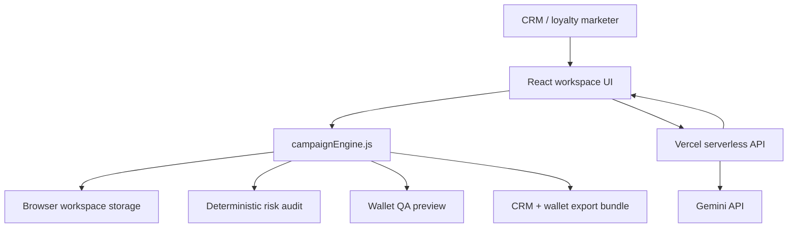

# LoyaltyBoost AI

**LoyaltyBoost AI is a production-shaped promotion workspace for loyalty and CRM teams.** It helps marketers draft margin-aware loyalty campaigns, validate launch readiness, preview wallet-pass customer experiences, and export activation payloads for CRM and wallet implementation.

Live site: https://loyalty-boost-ai.vercel.app/

## What Changed

The project has moved beyond a presentation-only AI demo. It now includes:

- A campaign workspace with saved drafts in browser storage.
- A structured campaign schema for mechanics, tiers, budget, channels, legal copy, frequency caps, and launch status.
- A Vercel serverless AI endpoint at `api/generate-campaign.js`, so production AI keys are not stored in the browser.
- Deterministic fallback campaign generation when `GEMINI_API_KEY` is not configured.
- Deterministic launch-readiness and risk scoring for urgency, friction, fatigue, and margin exposure.
- Wallet pass QA with customer-variable substitution and barcode preview.
- CRM and wallet export bundle generation.
- Responsive SaaS-style UI for desktop, tablet, and phone layouts.
- Clean production build and lint checks.

## Core Product Surfaces

### Campaign Workspace

Create and edit loyalty campaigns with:

- Brand and business objective.
- Eligible loyalty tiers.
- Campaign channels.
- Budget cap and projected margin impact.
- Active window.
- Redemption method.
- Frequency cap.
- Promo code.
- Legal copy and exclusions.
- Draft, review, approved, and ready statuses.

Campaigns autosave to local workspace storage so users can return to drafts without losing work.

### AI Campaign Drafting

The frontend calls:

```text
POST /api/generate-campaign
```

In production, the serverless function uses `process.env.GEMINI_API_KEY`. If no key is configured, the client falls back to the deterministic campaign engine, keeping the app usable for demos and QA.

### Production Risk Audit

The app scores every active campaign across:

- Urgency and loss aversion.
- Redemption friction.
- Fatigue protection.
- Margin guardrail.
- Launch readiness.

The readiness checklist checks campaign name, eligibility, economics, redemption clarity, legal/exclusions, and channel copy completeness.

### Wallet Pass QA

The wallet preview simulates:

- Pass title and campaign status.
- Loyalty tier.
- Points balance.
- Barcode / promo-code activation.
- Resolved push notification.
- Resolved email subject.
- Liquid-style personalization such as `{{ user.first_name | default: 'there' }}`.

### Export Bundle

The export view produces JSON containing:

- Full campaign object.
- CRM activation payload shaped for systems like Braze, Iterable, Klaviyo, or Salesforce Marketing Cloud.
- Wallet pass implementation brief.
- Suggested analytics events.

## Architecture



## Production Configuration

Set this environment variable in Vercel:

```bash
GEMINI_API_KEY=your_server_side_key
```

No user API key is required in the browser.

## Development

```bash
npm install
npm run dev
npm run lint
npm run build
```

## Verification

Current checks:

```bash
npm run lint
npm run build
```

Both pass on the updated codebase.

## Tech Stack

- React 18
- Vite
- Vercel serverless functions
- Lucide React icons
- Vanilla CSS design system
- Gemini API via serverless route

## What Is Real Now

This is now a credible MVP shell:

- Campaigns are structured and editable.
- Drafts persist locally.
- AI calls are server-side.
- The app can operate without AI configuration.
- Readiness scoring is deterministic and inspectable.
- Exports are shaped for real CRM and wallet activation work.
- The layout is responsive.

## Next Integrations

The next production milestones are:

- Organization accounts and role-based approvals.
- Hosted database persistence with Supabase, Postgres, Firebase, or similar.
- OAuth integrations for Braze, Iterable, Klaviyo, Salesforce Marketing Cloud, or Segment.
- Apple Wallet `.pkpass` generation and Google Wallet pass object creation.
- Historical redemption data ingestion for ROI prediction and offer-fatigue modeling.
- Audit logs, billing, rate limits, and admin controls.

## Portfolio Summary

LoyaltyBoost AI is a loyalty promotion operating system prototype that turns a business goal into a structured campaign, validates the promotion against margin and behavior guardrails, previews the wallet-pass customer experience, and exports CRM-ready activation data. It demonstrates product strategy, AI workflow design, frontend engineering, serverless architecture, and production-readiness thinking.
